# TwoMillion
The info to reach the machine can be found on https://www.hackthebox.com/home/machines/profile/547.
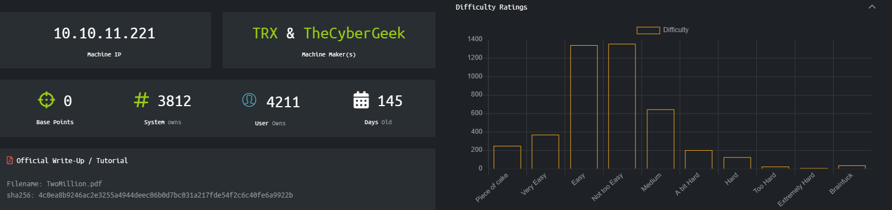  
  
## Walkthrough
The first thing as always was an nmap on the network:  
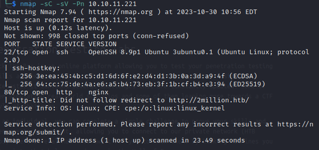  
  
The port 80 was open and it was running nginx. Also it shows that there was a redirecting to *http://2million.htb/ that was not followed in the nmap.  
I tried to open that URL in the browser but nothing showed up. After a brief search on the web I added this line to the /etc/hosts in the host machine: ```10.10.11.221    2million.htb``` to add that host to the known by the machine.  
Now, opening that URL in the browser shows the old (2017) HackTheBox homepage:  
  
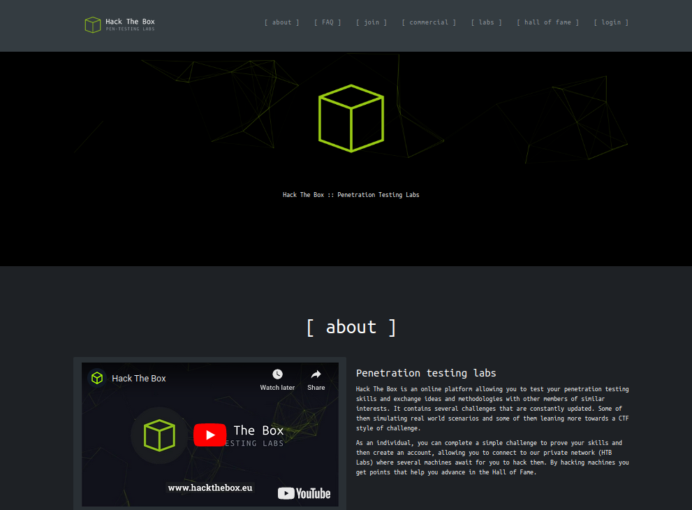
  
I looked in the various tabs to check if I could find something odd, but it seemed like it was all legit.  
At that time to register on HTB you had to go to the /invite url and then try to hack to get the invite code, only then you could register on the platform.  
  

  
So i went on that url and the checked the code of the page and I found this javascript.
```
     $(document).ready(function() {
            $('#verifyForm').submit(function(e) {
                e.preventDefault();

                var code = $('#code').val();
                var formData = { "code": code };

                $.ajax({
                    type: "POST",
                    dataType: "json",
                    data: formData,
                    url: '/api/v1/invite/verify',
                    success: function(response) {
                        if (response[0] === 200 && response.success === 1 && response.data.message === "Invite code is valid!") {
                            // Store the invite code in localStorage
                            localStorage.setItem('inviteCode', code);

                            window.location.href = '/register';
                        } else {
                            alert("Invalid invite code. Please try again.");
                        }
                    },
                    error: function(response) {
                        alert("An error occurred. Please try again.");
                    }
                });
            });
        });
```
  
So basically once you click on submit, the API .../verify is called and the frontend checks if the parameter 'success' is 1 and if the parameter 'data.message' is "Invite code is valid". Done that, the code in the form is stored and set as a cookie for the registration page automatically open.  
At this point I tried something not completely clever...


  
... that of course didn't work.  
I read again the code of the page and noticed a javascript called *inviteapi.min.js* , but its code was minified. I thank ChatGPT for the help here:
```
function verifyInviteCode(code) {
    var formData = {
        "code": code
    };

    $.ajax({
        type: "POST",
        url: '/api/v1/invite/verify',
        dataType: 'json',
        data: formData,
        success: function(response) {
            console.log(response);
        },
        error: function(response) {
            console.log(response);
        }
    });
}

function makeInviteCode() {
    $.ajax({
        type: "POST",
        url: '/api/v1/invite/how/to/generate',
        success: function(response) {
            console.log(response);
        },
        error: function(response) {
            console.log(response);
        }
    });
}
```

It turns out that there's another function *makeInviteCode()* that calls an api on */api/v1/invite/how/to/generate* to generate the invite code.  
  
At this point I did a POST request to that API, hoping to get the invite code in return.
  
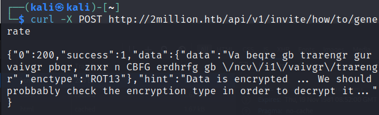
  
The answer is encrypted with the ROT13 cipher. It could be easily deciphered with some online tools (or even by hand). The result is the following: **In order to generate the invite code, make a POST request to \/api\/v1\/invite\/generate**
  
I did it and in response I got the invite. I submitted it on the invite page and...
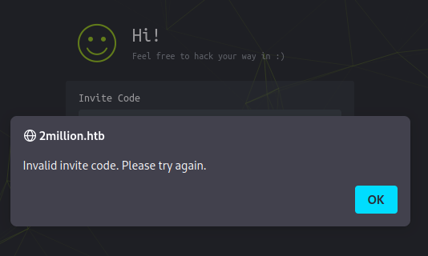
  
... not exactly expected, but I noticed that the string reminded me a base64 encoding. So I decoded it and got another string, that this time worked as an invite code. I registered to the website and then I could eventually login.  
  
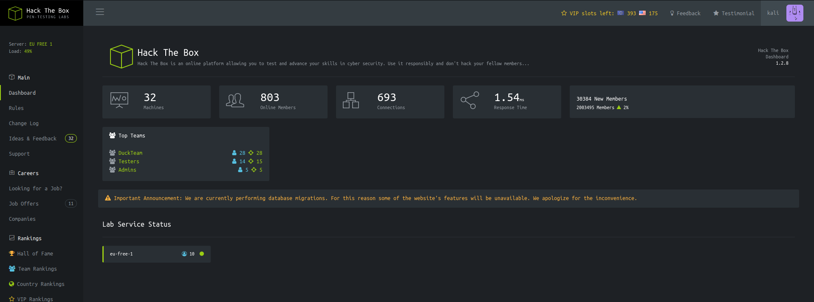
  
Only a few pages are actually working. I thought to look into the changelog, because maybe that could be some bug that could be useful. Not the case.  
The 'Access' page was the more interesting:  
  
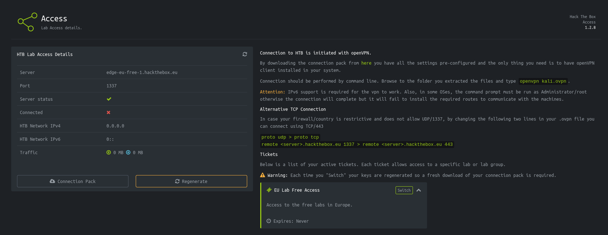
  
On this page it's possibile to dowload the .ovpn file to connect to the HTB lab. I tried to do so: the download goes just fine, but the connection to the vpn fails.
  
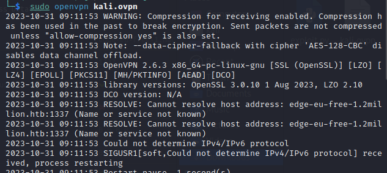
  
The first thing that i did was checking out that Warning, that was telling that **Compression for receiving enabled**.  
It turns out that "**There is a cyber-attack called VORACLE**, which captures up-stream packets that have been compressed and is able to extract data from those packets".  
Even though I looked for something, I couldn't find any way to make use of this vulnerability. So I had to look for something else.
I noticed that when downloading the connection pack, the frontend calls the API *2million.htb/api/v1/user/vpn/generate*. So i tried to connect to *2milion.htb/api* through the browser but nothing.  
Then i tried a curl to *2milion.htb/api/v1* but i got the status code 401 Unauthorized. So i figured out that i needed to give the PHPSESSIONID that i had in my browser session, where i was logged in.  
This time the terminal gave me a Route List of the API. I used **jq** to visualize better and that's the output.
  
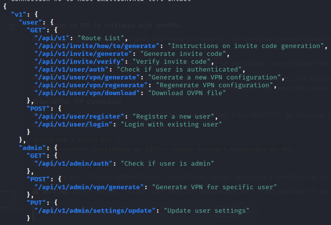
  
I tried to invoke the API */api/v1/admin/auth* to check if it was working. It returned me false, so it was working indeed.  
My goal at this point is to try to get a new admin user or to became an admin myself.  I tried a curl to the */api/v1/admin/vpn/generate*, but i got again the status code 401 Unauthorized.  
So i tried the other api, */api/v1/admin/settings/update*, that gave me the 200 OK but also gave me this message:  
```
{
"status": "danger",
"message": "Invalid content type."
}
```  
I'm not reporting all the steps, but in order to gain admin privileges I had to build a curl based on the response that i was receiving each time. The final, working, curl was this one:  
```  curl -sv -X PUT http://2million.htb/api/v1/admin/settings/update --cookie "PHPSESSID=e5ruquc5ivjg79bp6po7si0ice" --header "Content-Type: application/json" --data '{"email":"kali@kali.it", "is_admin" : 1}'  ```  
Now calling */api/v1/admin/auth* returns True, I'm an admin.  
  
At this point I should have the priviliges needed to call the *generate* API. With a simple curl I was getting *Invalid contant type*, so I had to specify it again.  
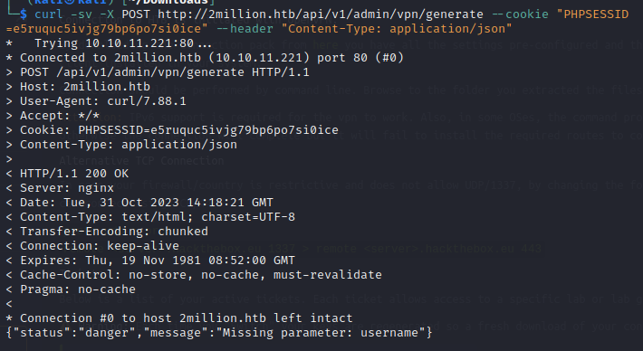  
  
The same old story. I gave the username in the body of the POST request.  
Doing this the API returned me the VPN configuration, including the certificate and the key.  
So apparently there aren't much checks on the username that one gives to the API, so it's worth checking if some sort of injection is possible.  
I repeated the curl, but this time I gave as an username: ```  --data '{"username":"kali123; id;"}' ```, receiving the answer I was hoping for:  
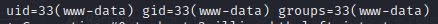
  
Apparently it's time for a reverse shell. For this I used the useful https://www.revshells.com/.  
I set up a nc listener with rlwrap and then on the server I injected the malicious payload.  It didn't work right away and I had to do a bit of trial and error to figure it out.  I encoded it in base64.  
  
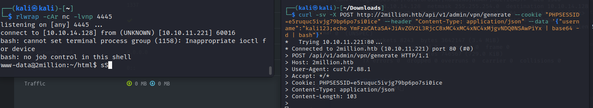
  
Browsing to the Desktop made me found the user.txt file, but unfortunately I didn't have the privileges to read it.  I needed some kind of privilege escalation.
  
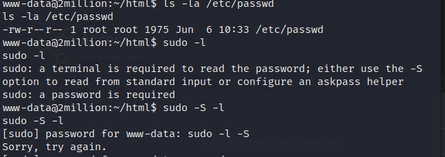
  
In order to do some basic operations I needed to upgrade my terminal. I did so with ``` python3 -c 'import pty; pty.spawn("/bin/bash")' ``` .  
Now it was needed a little bit of searching trough the directory, only to discover that what I was looking for was in the first one i saw back then.  
There is in /var/www/html a .env file containing the following:  
  
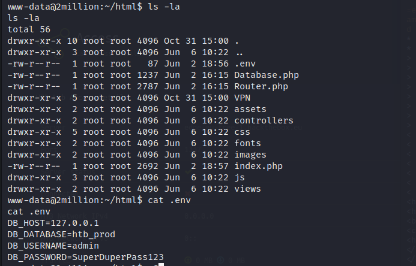
  
There is a database on the localhost and we have the credentials, so:
``` ssh admin@127.0.0.1 ``` and the insert the password just found.  
With a simple *ls* we can see again the file *user.txt*, but this time we have the privileges needed to read it.  **The first flag is eventually found**.
  
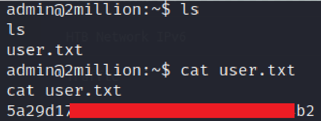
  
