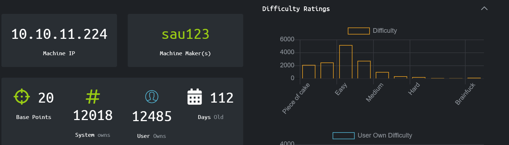
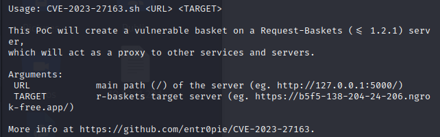
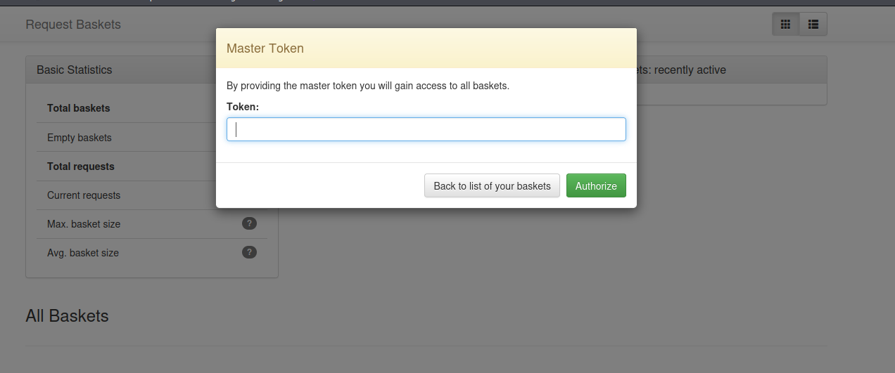
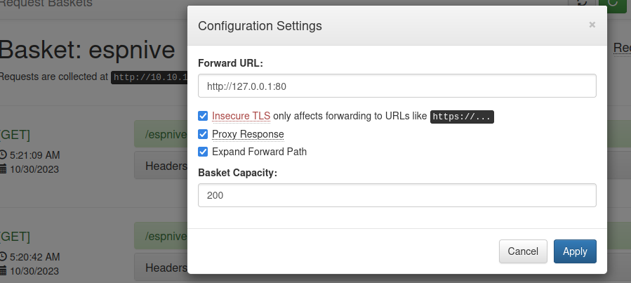
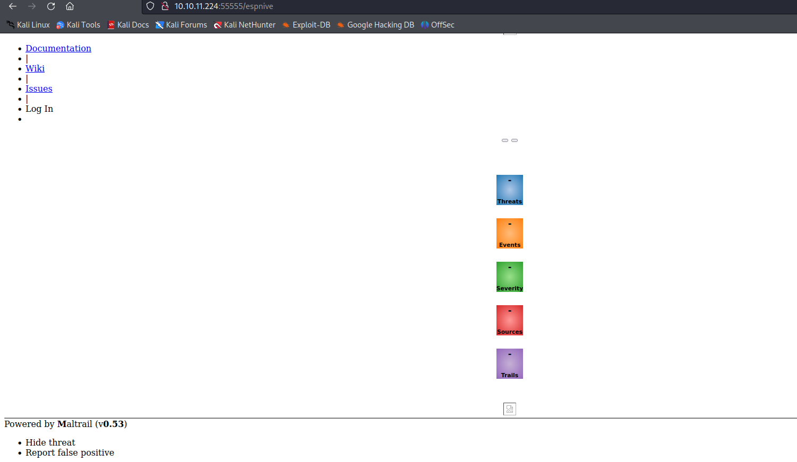
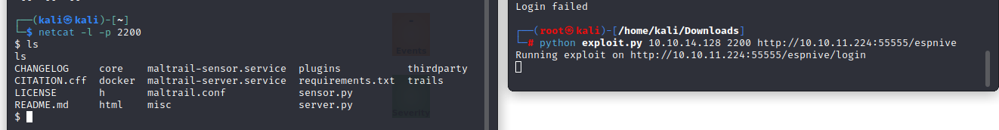
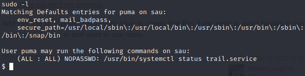
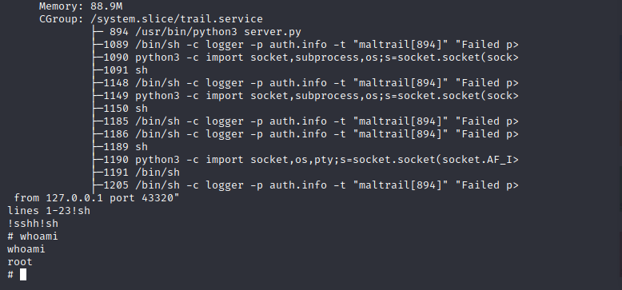

# Sau
 The info to reach the machine can be found on https://www.hackthebox.com/home/machines/profile/551.



## Discovery
The first step was of course check the reachability of the machine with a ping. Done that, the discovery phase could start with a nmap:  
``` nmap -sC -sV -Pn 10.10.11.224```  
  

  
The nmap showed three open ports: 22, 80 and 55555. The port 80 is always interesting, but the priority was of course the port 55555.    
The 55555 was open but the service was uknown. The first thing that I tried was to see if that something showed up in the browser, because maybe that way I could get some more information about the service running there.  
  

  
As you can see in the screenshot, I discovered that on the port 55555 it was running the service **request-basket** in the **1.2.1** version.  
A quick search on the web told me that "Request Baskets is a web service to collect arbitrary HTTP requests and inspect them via RESTful API or simple web UI".  
Moreover searching on Google for "request-basket v1.2.1 exploit" it made me discover that there is a well known vulnerability for this service version: the **CVE-2023-27163"**. 
At this point the road is traced, but I needed to study better the protocol and the CVE before passing to the exploitation phase.

## Exploitaiton
The script used can be easily find on the web and it is reported in the same directory of this README.  
The idea behind the script is to create a basket on the server and use it to proxy requests from other services from the same server.  
  
  
    
The script demands two parameters:  
- The url of the server, that is 10.10.11.224:55555;
- The target url.
  
Now the question is: what was my target url?    
My goal at this point was trying to retrieve the **Master Token**, that will grant me the access to all the baskets on the server, as you can see in the screenshot below.  


**SPOILER ALERT:** that was absolutely not the solution, but I couldn't know yet.  
Knowing that the port 80 was open, I thought to try to use the vulnerability to proxy the requests from the basket server to the port 80 on the same server.  
I tried to run the command ```exploit.sh 10.10.11.224:55555 http://10.10.11.224:80 ``` , but i got nothing.  
So I thought that maybe some service was running on the localhost, so i tried:  
``` exploit.sh 10.10.11.224:55555 http://127.0.0.1:80 ``` and this time it seemed that I was starting to get something, but the terminal was showing some issue caused by the TLS certificate.  
At this point I abandoned the script and created a basket by hand on the GUI of the service.  
  
  
As you can see, I selected all the checkboxes and then I connected to **http://10.10.11.224:55555/espnive** on the browser.  
I got this interface in response:  
  
  
   
None of the buttons on the right were clickable, and the  ones on the left just pointed to the docs on github.  
Quick search on the web and I found out that **Maltrail** is an open source IDS/IPS platform. I also found out that the v0.53 has a public vulnerability in its login page that allows to inject shell commands on the server through a crafted username (more details here: https://github.com/spookier/Maltrail-v0.53-Exploit).  
I set up a nc listener and then launched the exploit.  
  
  
  
Now I have a functioning reverse shell on the remote server.  
I started to browse through the filesystem I collected some infos:  
- One user called *puma* ;
- Two file on puma's desktop: *linpeas.sh* and *user.txt*.  
  
*linpeas.sh*, contained a script to linPEAS, probably some other user forgot to clean it up.
*user.txt* contains a single string: the hash. **The first flag is eventually found.**  
  
Now to find the root flag it is needed some privilege escalation.  

## Privilege Escalation
Some standard procedure of enumeration:
  
  
And, more interestingly...  

  
... telling us that all users can run, **as the sudo**, the trail.service under systemctl.  
A common way to perform privilege escalation in this kind of situations is to inject a payload of a reverse shell in the file shown up there.  
But in this case, remembering the Low Hanging Fruit statement, the solution was way simplier: the terminal showed the command that I could run with sudo. I did so:  
``` sudo systemctl status trail.service ``` 

that showed a bunch of info useless for the purposes of this PT.  
At this point the only thing needed was to exit this text interface, with a command like ``` !sh ``` and now we are in the sudo space!  
    

  
The root flag, as always, can be found browsing through the filesystem to the Desktop.