## Pilgrimage  

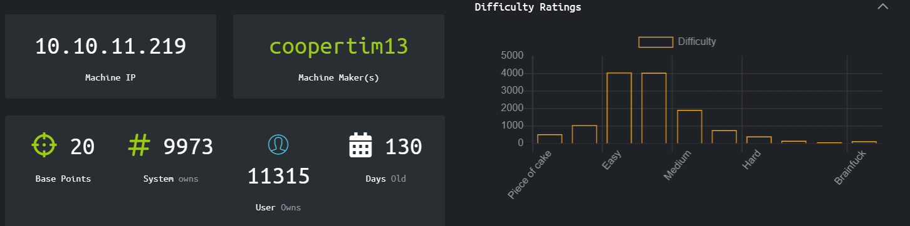
  
# Walkthrough
After checking the reachability of the machine, I did basic discovery operations.  
  
  
Two open ports: 22 and 80, where there is a server hosted on nginx.  
As you can read, it is specified that the nmap did not follow the redirection to http://pilgrimage.htb/. To solve this, I added that host to the /etc/hosts file with an ``` echo 10.10.11.219 pilrimage.htb > /etc/hosts```.  
Now the nmap follows the redirection, but more interestingly searching on the browser for http://pilgrimage.htb shows the following page:  
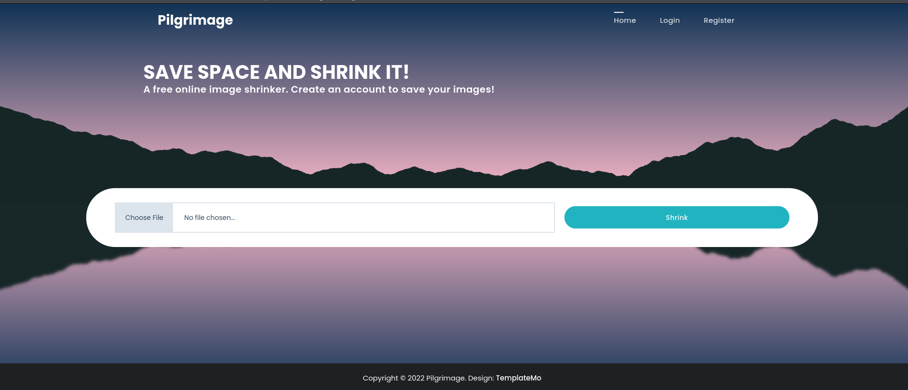  
  
It seems like the server hosts a web application to compress images. At first glance I thought that it could be possible to do some sort of injection, but let's look better at the webapp.  
I started by registering a new user to the platform (nothing to report here for the PT purposes) and then of course there will be the possibility to logout and login back again.  So it's clear there there will be a database behind the server that stores informations on the users.  
The GUI isn't really different if you login or not, but there is an further functionality if you login: when you compress an image, logged users can see on a tab called *'Dashboard'* the history of their compressions.  
Basically what happens is that you can upload a png/jpg and the server will compress the image and then return to you a URL where you can access the compressed image.  
  
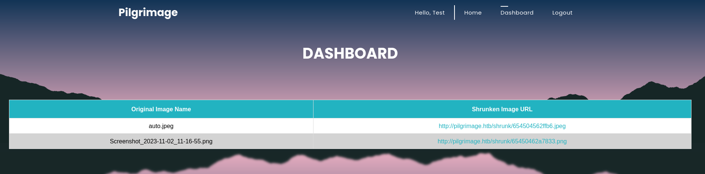
  
Just to report: I believed that the database had a table that stored the usernames and their history of association of image_name and shrunked_url, but actually it seems that it's all lost once the session closes.  
  
I went back to the compression tab and analyzed the code. I noticed that the check on the file-type is done by the frontend, so it's easy to upload a malicious file containing a php reverse shell.  
I did several test, also using **Burpsuite** to craft different request, but the reality is that I couldn't find a way to execute the reverse shell because:  
- The file don't really get stored in the server;
- Even though it's easy to get through the check on the filetype, it isn't so easy to execute the php file after that.  
  
Given that the security checks on the input seems to be weak, my idea was to try some sort of injection maybe using the file name.  To do this I used Burpsuite to craft request where the name of the file uploaded was something like *image.jpg;sleep 10* or *sleep 10; image.jpg*, hoping that on the backend server there would have been a function that called a shell passing the file.  It was not the case.  
Another idea that I had was to hide a php shell in an actual jpg file, editing the HEX of the image. There is some literature about it (for example https://rcenetsec.com/hide-malicious-shell-in-image-file/), but before doing this intricate operation it was certainly a better approach trying to see if I could get some other directories bruteforcing the host using **Dirbuser**.   

I must admit a mistake here, because Dirbuster didn't really got me nothing useful, but launching nmap again (as i should have done early on) showed me a hidden *.git* directory. Lesson learned.
  
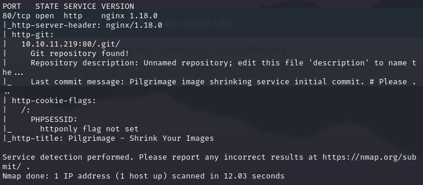
  
So the *.git* repository means that there we will find all the files componing the webapp. But of course, searching for that URL in the browser gives us *403 Unauthorized*.  
Fortunately there is a tool called **Git-Dumper** that gets the URL in input and then downloads all the files, retrieved by *host_url/.git/HEAD* (that is accessibile also by the browser).  
  
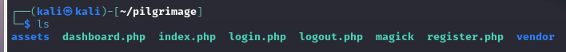
  
At this point I browsed through the files reading the code. The most interesting is *index.php*, where there is the following code: 

```php
if ($_SERVER['REQUEST_METHOD'] === 'POST') {
  $image = new Bulletproof\Image($_FILES);
  if($image["toConvert"]) {
    $image->setLocation("/var/www/pilgrimage.htb/tmp");
    $image->setSize(100, 4000000);
    $image->setMime(array('png','jpeg'));
    $upload = $image->upload();
    if($upload) {
      $mime = ".png";
      $imagePath = $upload->getFullPath();
      if(mime_content_type($imagePath) === "image/jpeg") {
        $mime = ".jpeg";
      }
      $newname = uniqid();
      exec("/var/www/pilgrimage.htb/magick convert /var/www/pilgrimage.htb/tmp/" . $upload->getName() . $mime . " -resize 50% /var/www/pilgrimage.htb/shrunk/" . $newname . $mime);
      unlink($upload->getFullPath());
      $upload_path = "http://pilgrimage.htb/shrunk/" . $newname . $mime;
      if(isset($_SESSION['user'])) {
        $db = new PDO('sqlite:/var/db/pilgrimage');
        $stmt = $db->prepare("INSERT INTO `images` (url,original,username) VALUES (?,?,?)");
        $stmt->execute(array($upload_path,$_FILES["toConvert"]["name"],$_SESSION['user']));
      }
      header("Location: /?message=" . $upload_path . "&status=success");
```
  
So:
1) The image is stored on the directory */tmp* just for the time of the compression, then unlinked -> Probably not the solution, but possibly *Race Condition* to exploit.
2) **There is a SQLITE database located in */var/db/pilgimage***.
3) The line *exec("/var/www/pilgrimage.htb/magick convert /var/www/pilgrimage.htb/tmp/" ...)* tells us that for the compression is used the tool **ImageMagick**.
  
The last info comes in handy: there is in fact a CVE on that tool, that permits to exploit the part where the compression happens to basically get to server to insert into the compressed image an arbitrary directory/file that we want to read (https://www.metabaseq.com/imagemagick-zero-days/).  
The idea is then using the exploit to read the content of the database in */var/db/pilgrimage*. 
I will not explain all the process to use the exploit, but you can find all the steps in the URL provided.   
I did a first try using the image that was already on the repository. That image managed to get me to read the content of */etc/passwd*, **discovering a system user called Emily**.  
Then i crafted the image to read the database repository and I used **Cyber Chefs** to decipher the output.    
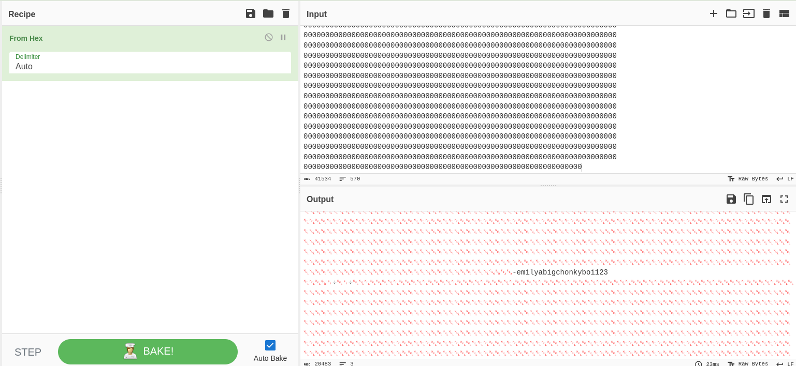

Important to notice, there is another, better, way to read the content of the database and it is to dowload all in a .dump file and the open it in the **sqlite3** terminal.  
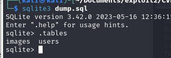
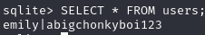
  
Either way I accomplished to get the credentials of the user Emily. *Images* table is empty.  
**I could then open a ssh session and retrieve the first flag**, the file *user.txt*.  
  
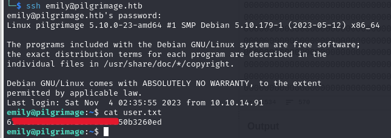

## Privilege escalation
I did some basic checks, like ```sudo -l``` but user Emily can't run sudo.  
At this point I went directly with running Linpeas, but as far as I could see there was no potential privilege escalation vector.  
I had to go back on the Pilgrimage dashboard and I tried to see if the credentials of user Emily also worked on the platform. They did, but the operation was also useless.  
I then tried to check the processes runned by sudo on the machine, with the command ```ps -f -u root```.  
I found a process called **malwarescan.sh** and I hoped that it was not a leftover from some other user.  
The sh file was located in */usr/sbin/malwarescan.sh* and I had the permissions to read it:  
  
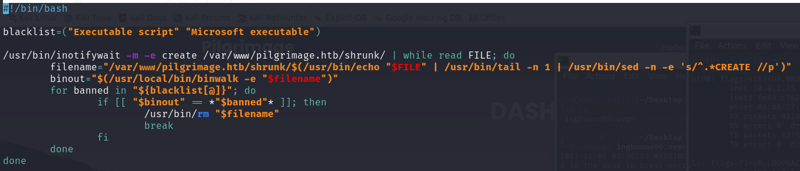
  
This script monitores */var/www/pilgrimage.htb/shrunk* and checks the images with **Binwalk**. If there is a correspondence with the words contained in a blacklist, it deletes the image.  
A quick lookup in the web and i found that Binwalk is a tool to analyze binaries, but, most important, it is affeceted by the CVE-2022-4510-Binwalk that basically consent to RCE.  
I used this script https://github.com/electr0sm0g/CVE-2022-4510/blob/main/RCE_Binwalk.py to get a reverse shell by passing the parameters needed and the manually uploading the .png file that i got in the vulnerable directory */var/www/pilgrimage.htb/shrunk*.     
I set up a netcat listener on my machine and put the png exploit in the previously said directory. Once Binwalk does its scan, the reverse shell gets activated and now we have access to the root flag on the remote host.  
  
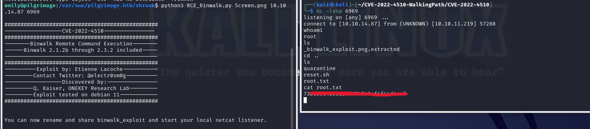 
  
**IMPORTANT!**  
A couple of things to notice:
- There could be some issue in the script with the python version you're running. It is needed Python 3.x.
- I didn't quite get why, but the script only seems to work to me if it is launched in the .../shrunk/ directory itself. Otherwise the reverse shell never got running.  
