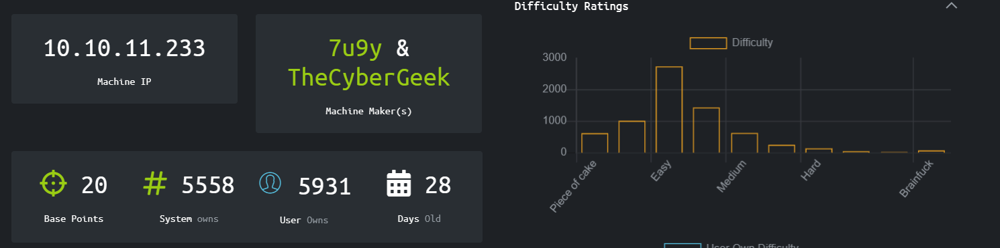
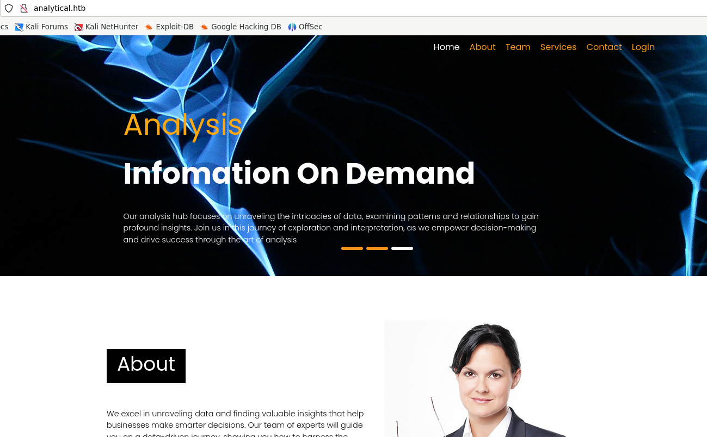
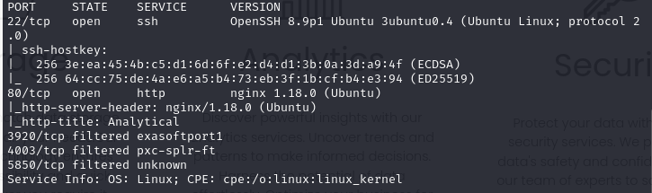
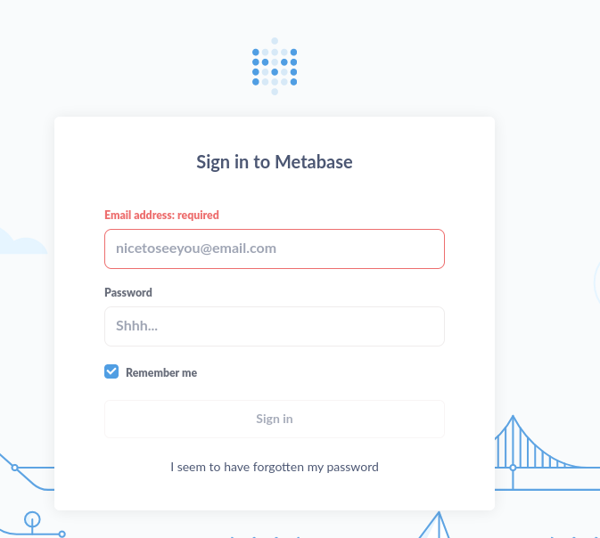
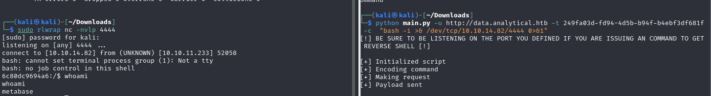
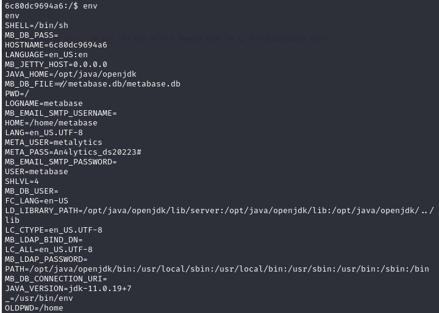
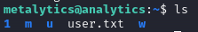

# Analytics 
More infos can be found here https://www.hackthebox.com/home/machines/profile/569.  

  
## Walkthrough
As first of course I did a ping to check the reachability of the host. Then some basic scanning with nmap.  
  
  
  
Two ports open: 22 and 80, but on the port 80 the nmap didn't follow the redirection to *http://analytical.htb/*. A common issue, to solve this it is only needed to add the mapping to the */etc/hosts* on the kali machine.  
Done that, it's better to run the nmap again to check if there is something new.  
While the nmap was doing its thing, I searched that URL on the web and this showed up:  

 
(there is more on the page if you scroll, but nothing really useful for our purposes)  
  
So on the port 80 the server is hosting a web application used to store and then analyze data.  
Meanwhile the nmap ended and showed this results:  
  
So there are **5 used ports**:
- 22;
- 80, used by the webapp;
- 3920, used by the service *exasoft port*;
- 4003, probably a worm left by some other user;
- 5850, unknown.
  
Back on the webapp I clicked on the *login* tab, but there is some issue with the connection. That's becaus the login tab redirects to **data.analytical.hbt**, so also this host needs to be added in */etc/hosts*. The fix worked.  
  
  
So the login is done through a service called **Metabase**. A quick search on the web and I discovered a CVE afflicting the service, for reference *https://pentest-tools.com/vulnerabilities-exploits/metabase-remote-code-execution_CVE-2023-38646*.  
Basically this CVE consent us to create a new database that will then be used for creating a reverse shell.
I then tried to exploit this POC *https://github.com/m3m0o/metabase-pre-auth-rce-poc*, giving to it the token found in the json of the response given by */api/session/properties* endpoint, other that the url and the command to execute a bash reverse shell.  
  

  
It was a pretty easy run. Doing ``` ls -la ``` I discovered some interesting things:
- We are in a docker container right now, because of the **.dockerenv** file;
- There is the file **metabase.db** stored here. It could be useful to read but because of the poor functionality of the sh shell, it isn't that easy. The sensible datas could also be encrypted.  
Seeing the .dockerenv file gave me the idea to run the ``` env ``` command. Doing that made me found the credendtials that i needed.  
  

  
**Now i can connect through ssh and get the user flag.**  
  
  
## Privilege escalation
