## Cap  
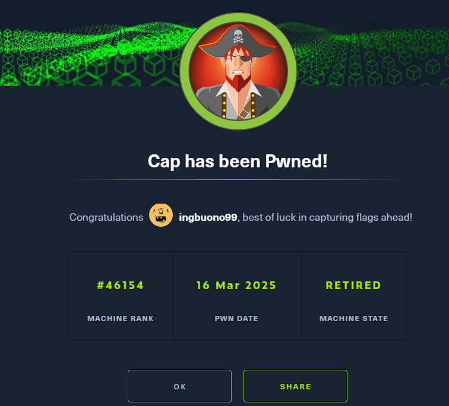
# Walkthrough
While the nmap was scanning, i reached that IP via broswer. There was an active service on http:  
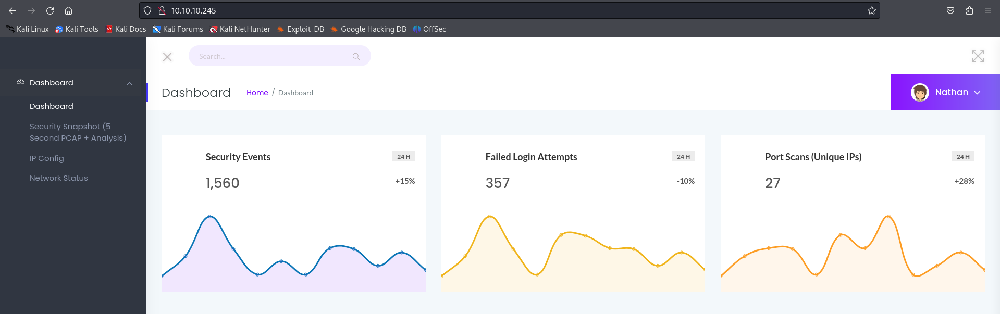  

Then the nmap showed its results:  
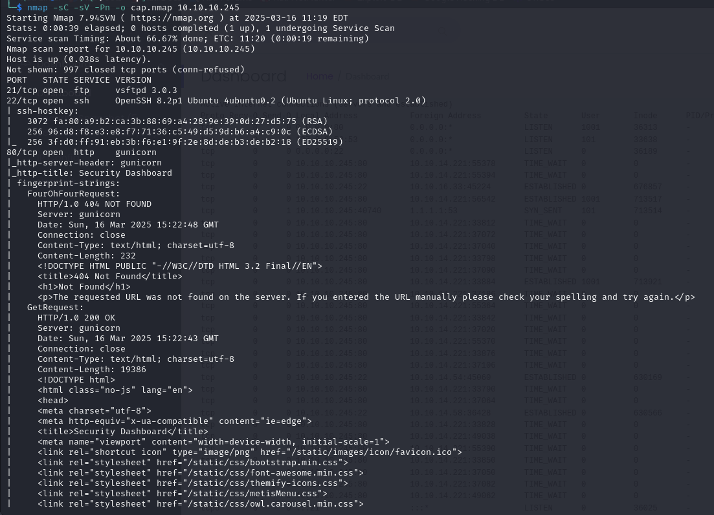  
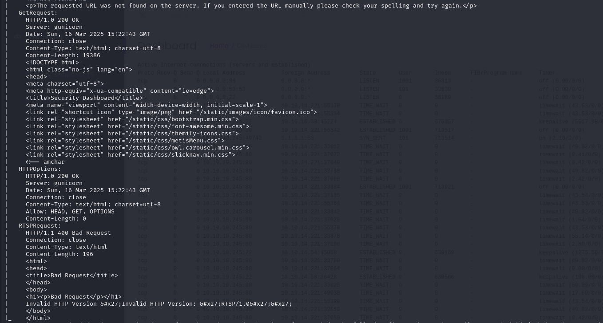  
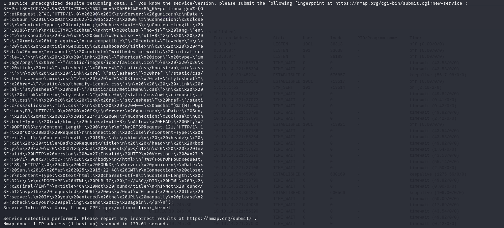  
Three ports open: 21 (FTP), 22 (SSH), 80 (HTTP).  
Let's also fuzz for unknown directories:  
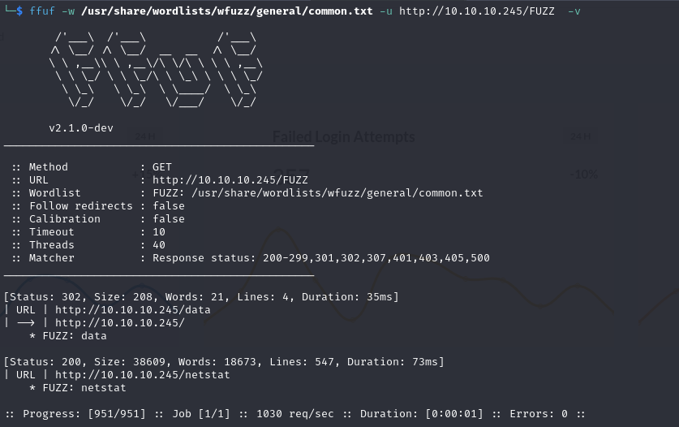  
  
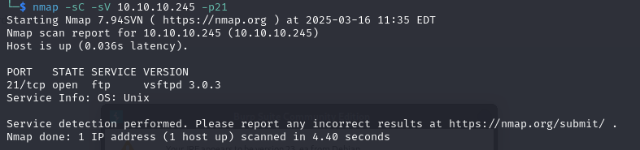  
Unfortunately no Anonymous login on FTP  
  
From the browser there was the possibility to download previously done scans by other user by changing the ID in the url:  
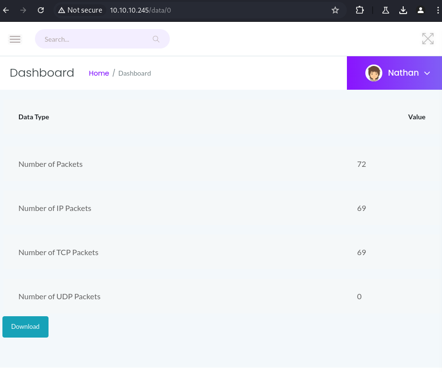  
Downloading the number 0 scan, there were a FTP packet exchange were the FTP credentials were in cleartext:  
  
  
By logging via FTP, i found the user flag:  
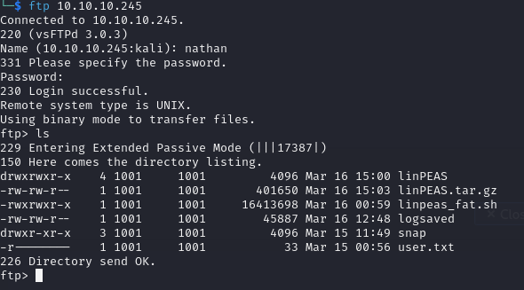  
  

## Privilege escalation
The same credentials also worked for ssh, I used them to open a shell and execute linpeas.  
  
  
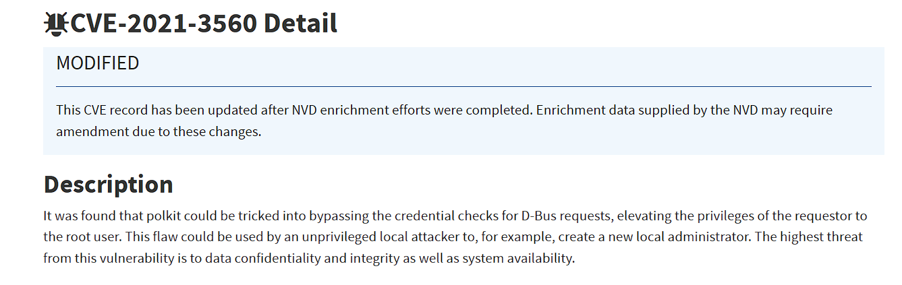  
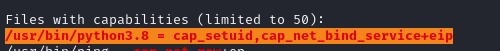  
  
The last screenshot is an interesting evidence.  
According to https://www.elastic.co/guide/en/security/8.17/potential-privilege-escalation-via-python-cap-setuid.html, it seems that there is the possibility to elevate privileges by leveraging the cap_setuid.  
I found the python commands online:  
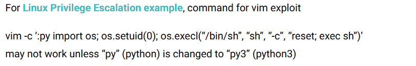  
So i opened a pyhton shell and executed these commands:  
``` import os; os.setuid(0); os.execl(“/bin/sh”, “sh”, “-c”, “reset; exec sh”) ```  
I got a root shell!  
  
Browsing through the root directory, i finally got the root flag:  
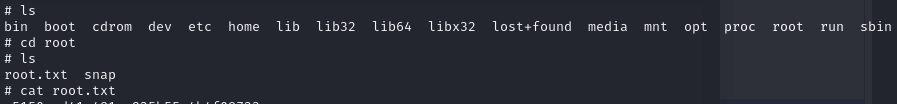  
