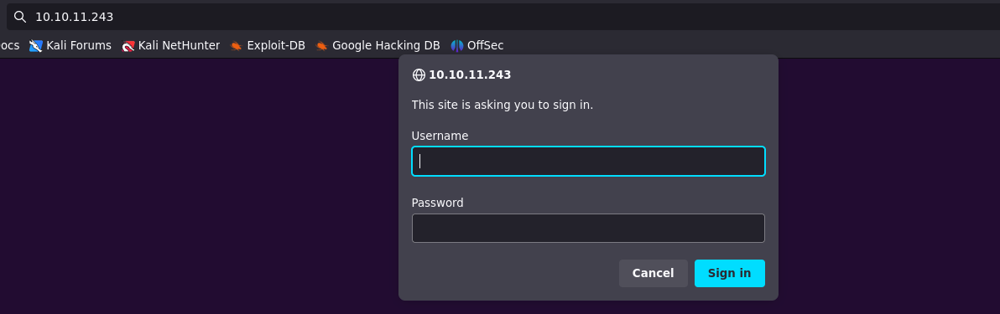
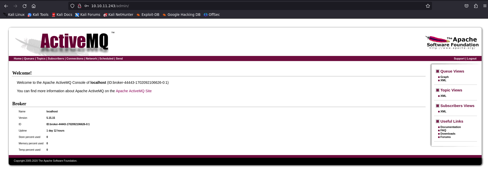
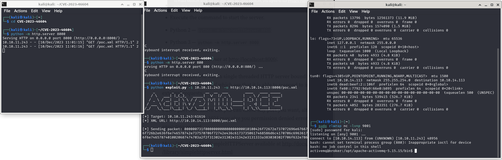
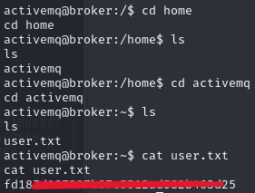
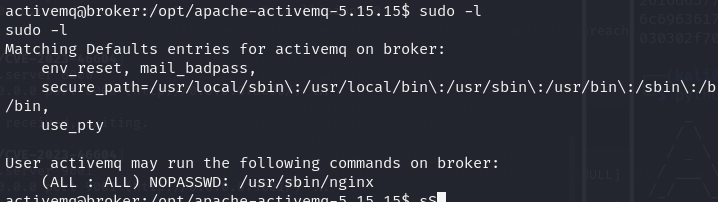
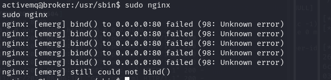
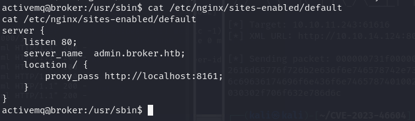
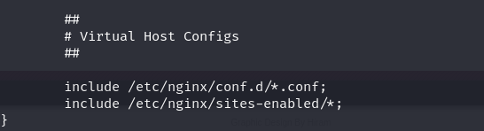
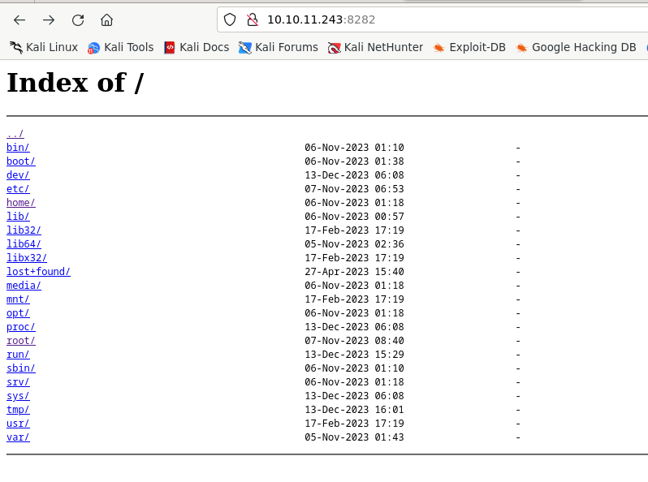

## Broker
  

  
# Walkthrough
I first did a simple scan with nmap that gave me the following result: 
  

  
There is the port 80 open but it returns error 401 Unauthorized.  
I tried to connect through the browser but it asked for credentials.  
  

The first thought went for credentials: admin/admin. Good enough!  
  
  
  
So there is an ActiveMQ server hosted and we have access to the admin's page. A quick look through the web and I found that this type of plaform is affected by the CVE-2023-46604. Also because this is classified as an easy machine on HTB it was with all probabilities the way to get a reverse shell on the server.  
I found this POC that i could use to exploit the CVE https://github.com/evkl1d/CVE-2023-46604.  
The exploit needs the xml file to be reachable via a url from the Apache server. So i set up a Python server on the port 8000 with the command ``` python -m http.server 8000 ``` in the folder of the exploit, so that it could host the poc.xml file.
 

   
Before running the exploit I changed the IP to in the poc.xml to my IP in the HTB vpn and then put a netcat shell in listening. At this point i could run the exploit.  
  
  
  
It worked and now we have a reverse shell on the Apache webserver.  
Browse through the folder to the home directory and then retrieve the user flag.  
  

  
## Privilege Escalation
Before running Linpeas I'm used to do basic Local Enumeration, as checking readability of */etc/shadow*, the enviroment variables or checking if it is possible to run sudo.  
By doing ``` sudo -l ``` I discovered that nginx is not protected and it is possible to run it with privileges even with the basic user without any password.  
  
  
Before doing anything I needed to upgrade the shell, and I did it with:  
```python3 -c 'import pty; pty.spawn("/bin/bash")' ```   
  
Then I tried to execute that path for nginx with sudo to see what would happen, but in return I got this error:  

  
I looked a bit on the web to try understanding this issue. This made me go take a look at the */etc/nginx/sites-enabled/default* file, where I found this line:  
  
I also found that that file was abilitated in the */etc/nginx/nginx.conf* file:    
  
  
Basically the */etc/nginx/sites-enabled/default* file enables the admin.broker.htb page on the port 8161 within the localhost.  
At this point I believed that I had to modify something in the configuration file to try to get a PE. Understanding what was the hard part.

The idea was to modify the user in the conf file to **root** and then running nginx with sudo, that way I should have been capable to see the /root/ directory where the flag is.  
Notice that I have the permissions to run nginx as sudo, but I can't modify the conf file directory.  I then created a very simple */tmp/nginx.conf* and then I used the command ```sudo nginx -c /tmp/nginx.conf ``` to start nginx with the new configuration file. The latter contained the following:  
  
```
user root;
events {
    worker_connections 1024;  
}

http {
    server {
        listen 8282;
        server_name localhost;
        #Directory
        root /;

        # Log files
        access_log /var/log/nginx/access.log;
        error_log /var/log/nginx/error.log;

        location / {
            try_files $uri $uri/ =404;
            autoindex on;  # Needed for directory listing
        }
    }
}
```  
  
Two things to notice:
- The autoindex on to abilitate directory listing, otherwise it was not possible to navigate through the files via browser.
- I had to start a different nginx server with the port 8080 (not the default), otherwise there was of course an error (*could not bind*) cause of the other server still running.  
  
This way I got the hands on the filesystem with root read privileges.  
  

  
As always, the flag can be found under */root/root.txt*.